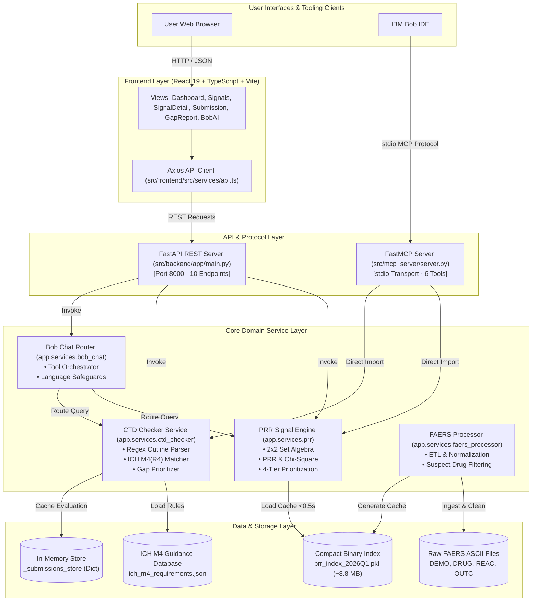

# Technical Architecture: AetherGuard AI

---

## 1. Architecture Overview

**AetherGuard AI** is engineered as a modular, high-performance pharmacovigilance and regulatory intelligence system. It combines an asynchronous **FastAPI** backend, a **React 19** single-page application (SPA), and a **FastMCP** stdio server that enables native integration with AI developer tools like **IBM Bob**.

The platform is designed around three architectural tenets:
1. **Deterministic Domain Execution**: All mathematical calculations (PRR, Chi-Square, $2\times 2$ contingency table partitioning) and structural compliance checks (ICH M4 regex matching) are executed in pure, deterministic Python with zero generative hallucinations.
2. **Sub-Second In-Memory Performance**: Complex relational joins across millions of FAERS association rows are pre-indexed into a compact binary cache (~8.8 MB `.pkl`), enabling cold-start load times of ~0.43s and query latencies of 5–15 ms.
3. **Multi-Channel Interoperability**: Core services are decoupled and exposed simultaneously via REST API endpoints for the web frontend and Model Context Protocol (MCP 2.x) tools for conversational AI assistants.

---

## 2. Mermaid Architecture Diagram



---

## 3. Component Table

| Component | Technology | Version | Responsibility | Inputs | Outputs | Communication |
| :--- | :--- | :--- | :--- | :--- | :--- | :--- |
| **Frontend SPA** | React, TypeScript, Vite | React 19.3.0, Vite 8.3.0, TS 6.0 | Renders executive dashboard, signal explorer, $2\times 2$ contingency views, CTD scorecards, and Bob chat interface. | User mouse/keyboard actions, URL parameters | Rendered HTML/CSS DOM, JSON API requests | HTTP REST via Axios to FastAPI |
| **FastAPI Backend** | FastAPI, Uvicorn, Python | FastAPI 0.116.2, Uvicorn 0.35.0 | Exposes 10 REST endpoints, enforces Pydantic schemas, handles CORS, and pre-loads cache during startup lifespan. | HTTP JSON bodies, query parameters, path variables | HTTP JSON responses | HTTP REST / JSON |
| **MCP Server** | FastMCP (`mcp` library) | MCP 1.26.0 | Exposes 6 standardized tools to IBM Bob via stdio; contains zero duplicate business logic. | JSON-RPC requests via stdio | JSON-RPC tool responses via stdio | Standard I/O (`stdin`/`stdout`, logging on `stderr`) |
| **PRR Signal Engine** | Python, NumPy, Pandas | Python 3.11+ | Computes exact $2\times 2$ partition ($A, B, C, D$), PRR, Pearson $\chi^2$, confidence tiers, and 4-tier review priority. | Drug name, event name, filter parameters | Statistical dictionary containing cell counts, rates, PRR, $\chi^2$, priority, disclaimer | In-process Python function calls |
| **CTD Checker Service** | Python, Regex, JSON | Python 3.11+ | Parses dossier outlines, executes sub-section hierarchical matching, calculates module completeness (M1–M5), and classifies gaps. | Raw dossier text outline, optional submission ID | Evaluation dictionary with module scores, readiness status, prioritized gaps | In-process Python function calls |
| **Bob Chat Router** | Python, Regex | Python 3.11+ | Performs intent classification on natural language queries, routes to PRR/CTD services, formats text, and enforces safety disclaimers. | User message string, optional dossier text or submission ID | `BobChatResponse` schema containing text, intent, tool used, structured data, disclaimer | In-process Python function calls |
| **FAERS Processor (ETL)** | Python, Pandas, NumPy | Python 3.11+ | Offline ingestion pipeline: joins raw DEMO, DRUG, REAC, OUTC; standardizes `prod_ai`; filters suspect drugs (`PS`/`SS`); exports binary cache. | Raw quarterly ASCII files (`$`-delimited) | `faers_2026Q1_normalized.csv` (~1.1 GB) & `prr_index_2026Q1.pkl` (~8.8 MB) | Offline Python script execution |

---

## 4. End-to-End Data Flow

```
   1. USER REQUEST (Browser or IBM Bob)
          │
          ├── [Web Path]: Axios POST /signals or /submission/check ──→ FastAPI (app/main.py)
          └── [Bob Path]: JSON-RPC via stdio ──→ FastMCP Server (server.py)
          │
   2. VALIDATION & DISPATCH
          │
          ├── Pydantic validates input schemas (Query params, dossier string)
          └── Router delegates to singleton service instance (app/services/)
          │
   3. DOMAIN PROCESSING
          │
          ├── [PRR Path]: Look up drug/event in in-memory index ──→ Compute A, B, C, D
          │               Compute PRR = (A/(A+B))/(C/(C+D)) & Chi-Square ──→ Assign Priority Tier
          └── [CTD Path]: Regex line-by-line parser extracts section codes ──→ Match against ICH M4
                          Calculate module completeness % ──→ Sort gaps (CRITICAL/HIGH/MEDIUM)
          │
   4. CACHING & RESPONSE PACKAGING
          │
          ├── CTD result cached in in-memory `_submissions_store` by submission_id
          └── Mandatory safety / regulatory disclaimers attached to payload
          │
   5. CLIENT RENDERING
          │
          ├── [Web]: React updates state, renders tables, badges, and contingency cards
          └── [Bob]: MCP server formats clean text block and returns to Bob chat window
```

1. **Client Interaction**: User triggers an action in the React web UI or sends a prompt to the IBM Bob IDE.
2. **API / Protocol Ingestion**:
   * *Web*: Axios issues a typed HTTP request to FastAPI (e.g. `POST /submission/check`).
   * *Bob IDE*: Sends a JSON-RPC tool call over `stdio` to `src/mcp_server/server.py`.
3. **Validation & Routing**:
   * Pydantic v2 schemas validate data types and bounds (e.g. `min_prr >= 0.0`, `1 <= limit <= 500`).
   * Calls are dispatched to the singleton domain services in `src/backend/app/services/`.
4. **Core Computation**:
   * *Safety Signal Path*: `prr.py` performs $O(1)$ set count lookups from the binary index, constructs the $2\times 2$ partition, evaluates reporting rates, PRR, and Pearson $\chi^2$, and applies the 4-tier prioritization logic.
   * *CTD Checker Path*: `ctd_checker.py` normalizes section strings, matches against 21 required sections from `ich_m4_requirements.json`, computes per-module percentages, and sorts gaps by priority (`CRITICAL` $\to$ `HIGH` $\to$ `MEDIUM`).
5. **Caching & Result Storage**:
   * CTD evaluations are stored in `_submissions_store` under a unique 8-character ID.
6. **Delivery & Presentation**:
   * Responses are bundled with mandatory pharmacovigilance and CTD regulatory disclaimers and returned to the client for rendering.

---

## 5. Important Implementation Details

### REST API Route Definitions (`src/backend/app/main.py`)
* `GET /health` — Operational health status and index load flag.
* `GET /stats` — Dataset universe metrics ($N=397,209$, active ingredients, reaction terms, pairs).
* `GET /signals` — Filterable safety signal discovery grid (`drug_name`, `min_prr`, `min_reports`, `priority`, `limit`).
* `GET /signals/{drug}/{event}` — Exact $2\times 2$ contingency table detail ($A, B, C, D$), rates, PRR, $\chi^2$, confidence, and interpretation.
* `GET /compare` — Side-by-side independent PRR comparison of two drugs against the same adverse reaction.
* `POST /submission/check` — Dossier outline structural verification against ICH M4(R4).
* `GET /submission/{submission_id}` — Retrieve stored submission evaluation by ID.
* `GET /submission/{submission_id}/gaps` — Retrieve prioritized gaps (`CRITICAL`, `HIGH`, `MEDIUM`).
* `GET /submission/{submission_id}/modules/{module}` — Detailed drilldown for a single module (M1–M5).
* `POST /bob/chat` — Conversational assistant tool-orchestration bridge.

### MCP Tools (`src/mcp_server/server.py`)
1. `get_system_stats()` — Dataset universe counts ($N$, drugs, reactions, pairs).
2. `get_signals(drug, min_prr, min_reports, priority, limit)` — Ranked safety signal retrieval.
3. `get_signal_detail(drug, event)` — Full $2\times 2$ table, rates, PRR, $\chi^2$, and interpretation.
4. `check_submission_tool(dossier_text)` — Dossier structural completeness evaluation.
5. `get_gap_report(submission_id, priority)` — Missing required sections sorted by priority.
6. `get_submission_module(submission_id, module)` — Granular module score and section inventory.

---

## 6. Security Analysis

### Implemented Controls
* **Strict Secrets Isolation**: Configuration is decoupled using `pydantic-settings`. The `.env` file is excluded via `.gitignore`, and `.env.example` provides safe templates.
* **CORS Protection**: Explicitly restricts allowed origins to `localhost` and `127.0.0.1` on ports 3000, 5173, and 8000.
* **Input Validation**: Pydantic models validate all incoming payloads, preventing parameter tampering.
* **Non-Causal Legal Disclaimers**: Hardcoded medical and regulatory disclaimers in all API and MCP responses prevent legal and regulatory misrepresentation.
* **Prompt Injection Resilience**: The Bob AI chat router relies on deterministic keyword routing and tool execution rather than open-ended string concatenation into third-party LLM prompts.

### Partially Implemented Controls
* **Transport Security**: Configured for local HTTP during development; requires TLS termination in staging/production.

### Not Implemented (Hackathon Scope)
* **Authentication & Authorization**: Endpoints are currently open for local evaluation without OAuth2 / JWT authentication or RBAC.
* **Rate Limiting**: No IP-based rate limiting on REST endpoints.

### Recommended Future Hardening
* Integrate OAuth2 / JWT bearer token authentication.
* Deploy behind an Nginx or Cloudflare reverse proxy with TLS 1.3 and rate limiting.
* Implement role-based access control (e.g. `PV_SCIENTIST` vs `REGULATORY_LEAD`).

---

## 7. Scalability Analysis

### Current Performance Metrics (Local Prototype Validation)
* **In-Memory PRR Index Load Time**: ~0.43 seconds.
* **Query Latency**: ~5–15 ms per signal search.
* **Memory Footprint**: ~8.8 MB for the precomputed index of 397,209 reports.

### Identified Bottlenecks
* **In-Memory Submission Store**: `_submissions_store` is stored in server memory; restarting the process clears stored submission results.
* **Single-Node In-Memory Storage**: While highly efficient for 2026 Q1 ($N=397,209$), scaling to 10+ years of historical FAERS data (~20 million reports) will require partitioned external storage.

### Future Scaling Strategy
* **Persistent Cache**: Transition `_submissions_store` to **Redis**.
* **Longitudinal Storage**: Utilize **DuckDB** or **PostgreSQL with timescale partitioning** for multi-year longitudinal disproportionality queries.
* **Containerized Deployment**: Package backend in Docker and deploy on Kubernetes or IBM Cloud Code Engine with horizontal auto-scaling.

---

## 8. Failure Handling & Resilience

* **Zero Denominator Protection**: `compute_prr_partition()` explicitly handles edge cases ($A+B=0$, $C+D=0$, $C=0$, $A=0$), returning formatted explanation strings rather than runtime crashes or division-by-zero errors.
* **Missing Dataset Fallback**: If the processed FAERS CSV/index is absent, `SignalDetectionEngine` logs a warning and automatically loads a validated synthetic dataset for continuous test execution.
* **Case & Code Normalization**: Section IDs and drug names are cleaned with case-insensitive whitespace stripping to tolerate irregular user input.
* **UI Error Boundaries**: The React frontend provides retryable `ErrorState` components on API failure.

---

## 9. Repository Mapping

| Architecture Layer | Core Source Files |
| :--- | :--- |
| **FastAPI REST Server** | [`src/backend/app/main.py`](file:///c:/Users/LENOVO/Desktop/bob-ai-hackathon-TechTrix/src/backend/app/main.py), [`src/backend/app/config.py`](file:///c:/Users/LENOVO/Desktop/bob-ai-hackathon-TechTrix/src/backend/app/config.py) |
| **Pydantic Schemas** | [`src/backend/app/schemas.py`](file:///c:/Users/LENOVO/Desktop/bob-ai-hackathon-TechTrix/src/backend/app/schemas.py), [`src/backend/app/ctd_schemas.py`](file:///c:/Users/LENOVO/Desktop/bob-ai-hackathon-TechTrix/src/backend/app/ctd_schemas.py) |
| **PRR Signal Engine** | [`src/backend/app/services/prr.py`](file:///c:/Users/LENOVO/Desktop/bob-ai-hackathon-TechTrix/src/backend/app/services/prr.py) |
| **CTD Checker Service** | [`src/backend/app/services/ctd_checker.py`](file:///c:/Users/LENOVO/Desktop/bob-ai-hackathon-TechTrix/src/backend/app/services/ctd_checker.py) |
| **Bob AI Chat Router** | [`src/backend/app/services/bob_chat.py`](file:///c:/Users/LENOVO/Desktop/bob-ai-hackathon-TechTrix/src/backend/app/services/bob_chat.py) |
| **FAERS Processor (ETL)** | [`src/backend/app/services/faers_processor.py`](file:///c:/Users/LENOVO/Desktop/bob-ai-hackathon-TechTrix/src/backend/app/services/faers_processor.py) |
| **MCP Server for Bob** | [`src/mcp_server/server.py`](file:///c:/Users/LENOVO/Desktop/bob-ai-hackathon-TechTrix/src/mcp_server/server.py), [`.bob/mcp.json`](file:///c:/Users/LENOVO/Desktop/bob-ai-hackathon-TechTrix/.bob/mcp.json) |
| **React Frontend SPA** | [`src/frontend/src/App.tsx`](file:///c:/Users/LENOVO/Desktop/bob-ai-hackathon-TechTrix/src/frontend/src/App.tsx), [`src/frontend/src/pages/`](file:///c:/Users/LENOVO/Desktop/bob-ai-hackathon-TechTrix/src/frontend/src/pages) |
| **ICH M4 Requirements** | [`data/ich_m4_requirements.json`](file:///c:/Users/LENOVO/Desktop/bob-ai-hackathon-TechTrix/data/ich_m4_requirements.json) |
| **Test Suites** | [`src/backend/app/services/test_prr.py`](file:///c:/Users/LENOVO/Desktop/bob-ai-hackathon-TechTrix/src/backend/app/services/test_prr.py), [`src/backend/app/services/test_ctd_checker.py`](file:///c:/Users/LENOVO/Desktop/bob-ai-hackathon-TechTrix/src/backend/app/services/test_ctd_checker.py), [`src/backend/app/test_api.py`](file:///c:/Users/LENOVO/Desktop/bob-ai-hackathon-TechTrix/src/backend/app/test_api.py), [`src/backend/app/test_bob_chat.py`](file:///c:/Users/LENOVO/Desktop/bob-ai-hackathon-TechTrix/src/backend/app/test_bob_chat.py), [`src/mcp_server/test_mcp_server.py`](file:///c:/Users/LENOVO/Desktop/bob-ai-hackathon-TechTrix/src/mcp_server/test_mcp_server.py) |
